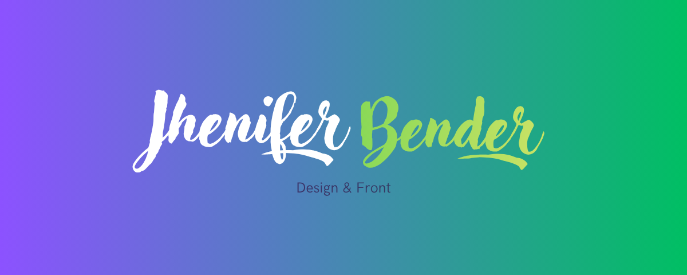

  

## 👋 Sobre Mim
 

Olá! Sou **Jhenifer Bender**, estudante de Design e T.I, apaixonada por desenvolvimento web e design gráfico.

Atualmente atuo criando interfaces modernas, responsivas e intuitivas, buscando unir criatividade e tecnologia para transformar ideias em experiências digitais.
E mais recentemente venho estudando o amplo campo do design gráfico e identidade visual.

### 💡 Áreas de Interesse

- Desenvolvimento Front-end
- UI/UX Design
- Design Gráfico
- Desenvolvimento Web
- Identidade Visual
- Ilustração
 

---

## 🎓 Educação
 

  

 

<h2 align="center">Centro Universitário de Pinhais - Unicesumar</h2>
 

<h3>📚 Graduação em andamento - 2026 | 2028</h3>

<h3>🎨 Design Gráfico</h3>
 

---
## 🚀 Tecnologias
 

### 💻 Desenvolvimento

  

 

### 🎨 Design

  

 

---

## 📊 Estatísticas GitHub
 

  
 
  

---

## 🔥 Sequência de Contribuições
 

  

 

---

## 🌟 Projetos em Destaque
 

  

<h2 align="center">🎮 Ludus | TCC 2025 ( Trabalho de Conclusão de Curso )</h2>

Plataforma voltada à divulgação e avaliação de jogos independentes brasileiros.

 
 

**Minha participação no projeto**
- Desenvolvimento de dashboards
- Implementação do sistema de alteração e exclusão de jogos
- Estilização de páginas
- Desenvolvimento do sistema de favoritos e curtidas
 
 

**Tecnologias:**
PHP • MySQL • JavaScript • CSS

---

<h2 align="center">🎨 Portfólio Artístico de Astra Soul</h2>

Portfólio profissional para divulgação de comissões de arte digital.

 
 

**Principais adições**
- Página de apresentação
- Galeria de artes
- Página de informações gerais
- Simulador de comissões
 
 

**Tecnologias:**
HTML • SCSS • JavaScript

---
## 🎯 Atualmente Estudando

- Desenvolvimento Front-end
- UX/UI Design
- Acessibilidade Web
- JavaScript Moderno
- Boas práticas de desenvolvimento
- Teoria do Design

---

## 📈 Objetivos
 

✔ Aprimorar minhas habilidades em Front-end

✔ Aprimorar minhas habilidades em Design Gráfico

✔ Construir projetos com foco em UX

✔ Desenvolver soluções digitais criativas

✔ Expandir meu portfólio profissional
 
---

## 📫 Contate-me
 

📧 jhenifer.bender.tech@gmail.com

💼 LinkedIn:
https://www.linkedin.com/in/jhenifer-bender/

🌐 Portfólio:
Em desenvolvimento

---

  ✨ Obrigada por visitar meu perfil! ✨

  <i>"Transformando ideias em experiências digitais."</i>

